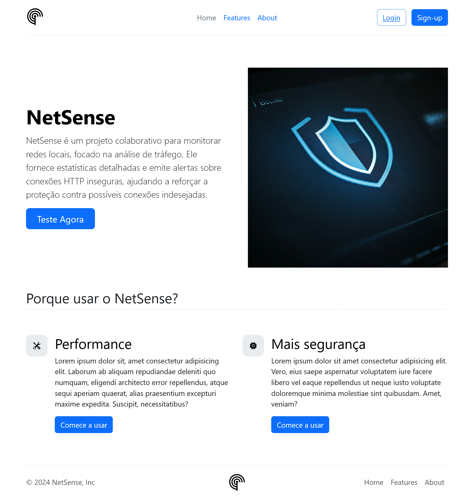

# NetSense

[NetSense](https://jacksoan-eufrosino.github.io/NetSense) é um projeto colaborativo para monitorar redes locais, focado na análise de tráfego. Ele fornece estatísticas detalhadas e emite alertas sobre conexões HTTP inseguras, ajudando a reforçar a proteção contra possíveis conexões indesejadas.

## Apresentação

## Licença

[MIT](https://github.com/Jacksoan-Eufrosino/NetSense/blob/main/LICENSE)
