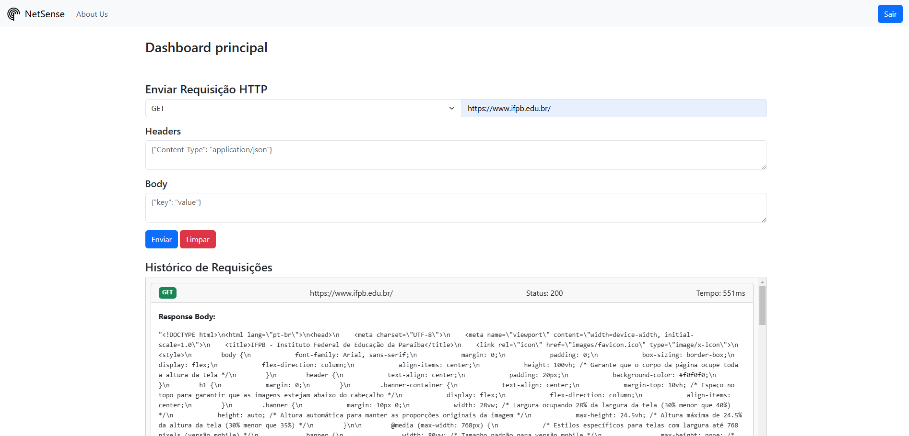

# NetSense Dashboard

NetSense Dashboard é uma aplicação web que permite aos usuários enviar requisições HTTP, visualizar as respostas e manter um histórico das requisições realizadas.


## Funcionalidades

- Enviar requisições HTTP (GET, POST, PUT, DELETE)
- Visualizar o corpo da resposta, cabeçalhos da resposta e cabeçalhos da requisição
- Manter um histórico das requisições realizadas
- Limpar o histórico de requisições
- Autenticação de usuários



## Tecnologias Utilizadas

- Frontend: HTML, CSS, JavaScript, Bootstrap
- Backend: Node.js, Express, Axios
- Banco de Dados: Prisma (com SQLite)
- Autenticação: JWT (JSON Web Token), bcrypt

## Pré-requisitos

- Node.js instalado
- Gerenciador de pacotes npm ou yarn

## Dependências

- @prisma/client
- axios
- bcrypt
- body-parser
- cors
- dotenv
- express
- jsonwebtoken
- sqlite-async

## Instalação

1. Clone o repositório:

```bash
git clone https://github.com/Jacksoan-Eufrosino/NetSense.git
cd NetSense
```

2. Instale as dependências:

```bash
npm install
```

## Configuração

1. Configure o Prisma:

```bash
cd back/prisma/ ; npx prisma migrate dev --name init ; cd ../../
```

## Executando a aplicação

1. Inicie a aplicação:

```bash
npm start
```

2. Acesse a aplicação no navegador:

```bash
http://localhost:3000
```

## Alunos responsáveis

- Jacksoan Eufrosino
- José Ryann
- José Rodrigo S. Padilha

## Disciplina 

- Professor: Luiz Carlos Rodrigues Chaves
- Desenvolvimento Web - IFPB CSTRC